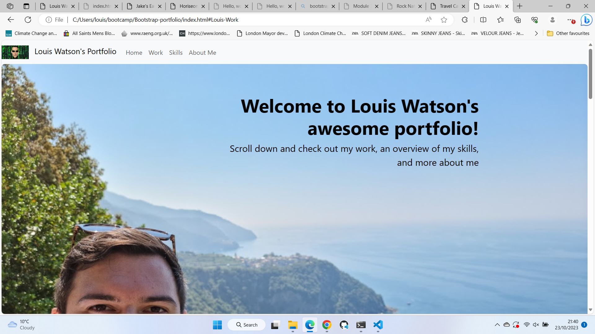

# Bootstrap-Portfolio
## Description

This application is Louis Watson's website that showcases his software development portfolio, some key skills and contact information. The application has been built to be flexible on all devices. 
I learned a lot during this process, particularly the utilisation of Bootstrap to more efficiently built HTML and CSS code.

## Installation

This application has been deployed live on Git Pages, and can be run by accessing the following URL: 

## Usage

Please see below screenshot of the application:

## Credits

Credit: self

## License

MIT License